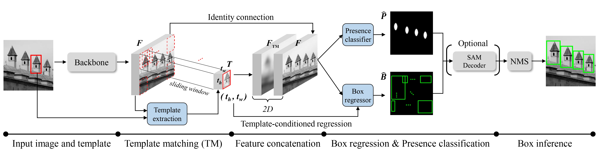

# Few-Shot Pattern Detection via Template Matching and Regression (ICCV25 Highlight)

**Eunchan Jo**,
[**Dahyun Kang**](https://dahyun-kang.github.io),
[**Sanghyun Kim**](https://oreochocolate.github.io/),
**Yunseon Choi**,
[**Minsu Cho**](https://cvlab.postech.ac.kr/~mcho/)

Official implementation of "Few-Shot Pattern Detection via Template Matching and Regression", <br> 
✨ ICCV 2025 (Highlight) ✨

[[Project Page]](https://chipmunk-g4.github.io/TMR/)
[[Paper]](https://arxiv.org/abs/2508.17636)
[[Dataset]](https://huggingface.co/datasets/ChipmunkG4/RPINE)
[[Model weights]](https://img.shields.io/badge/Checkpoint-Orange)

<a href="https://arxiv.org/abs/2508.17636"></a>
<!-- <a href="https://huggingface.co/ChipmunkG4/TMR_weights" target="_blank"></a> -->

</div>

## Overview

<p align="center">
    
</p>

>**Abstract**: <br>
> We address the problem of few-shot pattern detection, which aims to detect all instances of a given pattern, typically represented by a few exemplars, from an input image. Although similar problems have been studied in few-shot object counting and detection (FSCD), previous methods and their benchmarks have narrowed patterns of interest to object categories and often fail to localize non-object patterns. In this work, we propose a simple yet effective detector based on template matching and regression, dubbed TMR. While previous FSCD methods typically represent target exemplars as spatially collapsed prototypes and lose structural information, we revisit classic template matching and regression. It effectively preserves and leverages the spatial layout of exemplars through a minimalistic structure with a small number of learnable convolutional or projection layers on top of a frozen backbone. We also introduce a new dataset, dubbed RPINE, which covers a wider range of patterns than existing object-centric datasets. Our method outperforms the state-of-the-art methods on the three benchmarks, RPINE, FSCD-147, and FSCD-LVIS, and demonstrates strong generalization in cross-dataset evaluation.

## Installation and Data & Backbone weights Preparation
#### Note: this released version was tested on Python == 3.11.9, Pytorch == 2.4.0 and cuda == 12.1.

Install python dependencies:
```
pip install -r requirements.txt
```

#### * Data preparation
You can download **FSCD-147** and **FSCD-LVIS** datasets from the [Counting-DETR](https://github.com/VinAIResearch/Counting-DETR) repository.

You can download **RPINE** dataset form this [link](https://huggingface.co/datasets/ChipmunkG4/RPINE).

#### * Backbone weights preparation
You can download SAM backbone weights from the [SAM-HQ](https://github.com/SysCV/sam-hq?tab=readme-ov-file) and [SAM](https://github.com/facebookresearch/segment-anything?tab=readme-ov-file#model-checkpoints) repositories.

Place them in the `checkpoints` folder as shown in the 'Main Repository Structure' section below.


## Main Repository Structure
```
Template-Matching-And-Regression/
├── checkpoints/                      # place backbone checkpoints here
│   ├── sam_hq_vit_b.pth
│   ├── sam_hq_vit_h.pth
│   └── sam_vit_h_4b8939.pth
│   
├── weights\                          # place TMR weights here
│   ├── TMR_RPINE/best_model.ckpt
│   ├── TMR_FSCD147/best_model.ckpt
│   ├── TMR_FSCD_LVIS_seen/best_model.ckpt
│   └── TMR_FSCD_LVIS_unseen/best_model.ckpt
│   
├── scripts\                          
│   ├── train
│   └── eval
│   
└── others...

```

## Model weights

Download the pre-trained model weights from this [link](https://huggingface.co/ChipmunkG4/TMR_weights) and place them in the `weights` folder.

## Demo

```
python demo.py --ckpt ./weights/TMR_FSCD147/best_model.ckpt
```

## Training and Testing
### Training
Please change the `--datapath` argument to your own path where you have stored the dataset.

```
sh scripts/train/TMR_RPINE.sh
sh scripts/train/TMR_FSCD147.sh
sh scripts/train/TMR_FSCD_LVIS_Seen.sh
sh scripts/train/TMR_FSCD_LVIS_Unseen.sh
```

For detailed argument descriptions, please refer to `main.py`.

### Testing
To evaluate the pre-trained weights only, create a folder and copy the weight checkpoint into it, then change the `--logpath` argument to that folder's directory.

You can add the `--refine_box` argument to evaluate with the SAM decoder box refinement setting.

```
sh scripts/eval/TMR_RPINE.sh
sh scripts/eval/TMR_FSCD147.sh
sh scripts/eval/TMR_FSCD_LVIS_Seen.sh
sh scripts/eval/TMR_FSCD_LVIS_Unseen.sh
```

You can check the descriptions of all arguments used in the scripts by referring to `main.py`.


## Citation

If you find this work useful for your research, please cite our paper:

```bibtex
@inproceedings{jo2025tmr,
  title     = {Few-Shot Pattern Detection via Template Matching and Regression},
  author    = {Eunchan Jo, Dahyun Kang, Sanghyun Kim, Yunseon Choi, and Minsu Cho},
  booktitle = {International Conference on Computer Vision (ICCV)},
  year      = {2025},
}
```